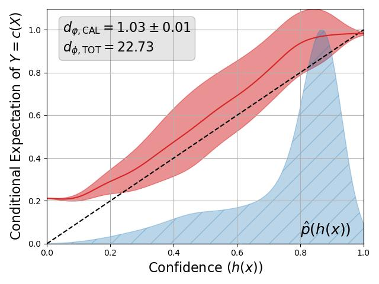

# sharpcal: Augmenting Calibration With Sharpness

`sharpcal` is a simple (work-in-progress) library for making calibration-sharpness plots based on: https://arxiv.org/abs/2406.04068.

A quick guide on how to read the above plot:
- The X-axis is model confidence, and the Y-axis is model accuracy conditional on confidence; the dashed line corresponds to a perfectly calibrated model.
- The curve in red represents a kernel regression estimate of the conditional expectation of model accuracy conditioned on model confidence.
- The area around the red line corresponds to a "sharpness gap", which can intuitively be thought of as leftover (pointwise) generalization error after accounting for (pointwise) calibration error. Once again, see https://arxiv.org/abs/2406.04068 for more details.
- The boxed errors shown at the top left of the plot display the calibration error (CAL) and total generalization error (TOT) respectively. In this case, the generalization metric is Brier score. The +/- shown next to the calibration error is a result of using subsampling to improve the computational efficiency of the kernel regression estimates, and corresponds to 1 standard deviation of the subsampled calibration errors (the displayed error is the mean).

# Installation
Installation is available via `pip` (or directly from source).
```sh
pip install sharpcal
```

# Getting Started
The following example demonstrates the main utilities of `sharpcal` on some synthetic data.
```python
import torch
from sharpcal.calibration import SharpCal
from sharpcal.kernels import Gaussian1D
from sharpcal.scores import BrierScore

kernel = Gaussian1D(bandwidth=0.05)
score = BrierScore()
sc = SharpCal(kernel=kernel, score=score, n_points=1000, device="cpu")

fake_probs, fake_labels = torch.rand(100, 1), torch.rand(100, 1).round().long()
sc.plot_cal_curve(fake_probs, fake_labels, fname=None)
```
The same example works with no changes even if we replace `fake_probs` and `fake_labels` above with multi-class versions.
```python
fake_probs = torch.nn.functional.softmax(torch.rand(100, 10), dim=1)
fake_labels = fake_probs.argmax(dim=1).unsqueeze(dim=1)
```
In this case, `sharpcal` automatically converts the multi-class calibration problem to the binary confidence calibration problem. This is done by replacing the multi-class labels with 0-1 correctness labels, and replacing the full softmax probabilities with the max predicted probability.

# Recreating Paper Experiments
A more advanced example that shows how to recreate the experiments in the paper can be found at `examples/recal_comparison.py`. This example also illustrates recalibration utilities available under `sharpcal.recal`.

# Citation

```bibtex
@misc{chidambaram2024reassessing,
      title={Reassessing How to Compare and Improve the Calibration of Machine Learning Models}, 
      author={Muthu Chidambaram and Rong Ge},
      year={2024},
      eprint={2406.04068},
      archivePrefix={arXiv},
      primaryClass={cs.LG}
}
```